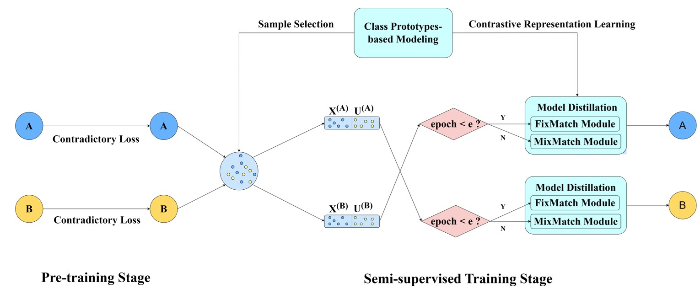

# CPSL

This repository is an official implementation of the paper: [CPSL: A semi-supervised framework with class prototype-based modeling for combating noisy labels](https://www.sciencedirect.com/science/article/abs/pii/S0031320325009793).

If you find this repository useful in your research, please cite:

```
Xia Q, Lee F, Xie L, et al. CPSL: A Semi-supervised Framework with Class Prototype-based Modeling for Combating Noisy Labels[J]. Pattern Recognition, 2025: 112318.
```

The effectiveness of deep learning models is primarily attributed to the development of datasets free from disturbances. However, these datasets contain noisy annotations due to mistakes in manual labeling. We propose a novel learning framework for learning with noisy labels in image classification tasks, called Class Prototype-based Modeling (CPM) for Semi-supervised Learning (CPSL). Experimental results on corrupted datasets, like CIFAR-10, CIFAR-100, Tiny-ImageNet, Animal10N and Clothing1M, demonstrate the effectiveness of our approach, particularly in challenging datasets, such as too-large categories and real-world scenarios.



# Setups

The environment is as bellow:

- Python
- Pytorch

# Running CPSL on benchmark datasets

Here is an example:

```bash
cd train

#Cifar10
python trian_cifar10.py

#Cifar100
python trian_cifar100.py

#Tiny-ImageNet
python trian_tinyImageNet.py

#Animal10N
python trian_animal10n.py

#Clothing1M
python trian_clothing1m.py

```

### Reference

[1]: Thank for TCC-net: A two-stage training method with contradictory loss and co-teaching based on meta-learning for learning with noisy labels.
